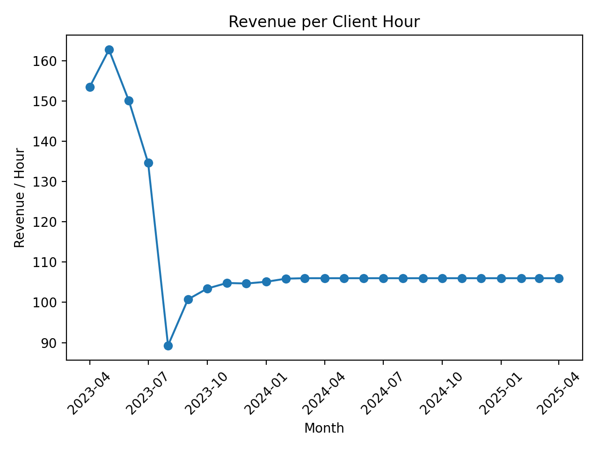

# Staff Productivity Analysis (KPI + Revenue Modeling)

## Executive Summary

This project shows how encounter-level service logs can be turned into monthly productivity and financial KPIs. The pipeline cleans raw data, converts time-based services into billable units, applies fiscal-year rate tables, and aggregates results into monthly trends. The end result is a reusable framework for evaluating provider productivity, revenue contribution, and utilization.

This project analyzes encounter-level service data to measure provider productivity, client engagement, and revenue contribution over time.

It demonstrates how operational service logs can be transformed into business-focused KPIs for performance evaluation and financial decision-making.

**Note:** This repository uses synthetic/de-identified data. No real client or private records are included.

---

## Business Objective

Given encounter-level service logs, this project answers:

- How many direct client hours were delivered each month?
- How much revenue was generated each month?
- How do productivity and revenue trend over time?
- What is revenue per client hour?
- What is the financial impact of a proposed compensation adjustment?

---

## Data

The dataset is a synthetic version of a service-based encounter export.

Key fields:

- `encounter_date`
- `cpt_code`
- `duration_min`
- `is_billable`
- `encounter_status`

Example dataset:

```
data/sample_monthly_data.csv
```

---

## KPI Definitions

**Client Hours (Monthly)**  
`client_hours = sum(duration_min) / 60`

**Units (15-Minute Time-Based Billing)**  
`units = floor(duration_min / 15)`

**Revenue (Monthly)**  
Time-based services:  
`revenue = sum(units * billing_rate)`

Per-encounter services:  
`revenue = sum(encounters * billing_rate)`

**Revenue per Client Hour**  
`revenue_per_hour = monthly_revenue / monthly_client_hours`

**Cost–Benefit Ratio (Optional Analysis)**  
`roi = monthly_revenue / monthly_compensation`

---

## Results

The following visualizations are generated from the KPI notebook and saved in the `outputs/` directory.

### Monthly Revenue


### Monthly Client Hours


### Revenue per Client Hour


## Key Insights

- Monthly revenue tracks closely with client hours, confirming that billable productivity drives financial performance.
- Revenue per client hour remains relatively stable across months, suggesting consistent service mix and billing structure.
- Revenue dips are primarily driven by lower encounter volume rather than changes in billing rates.
- This KPI framework provides a structured way to evaluate compensation changes against measurable revenue contribution.

---

## Repository Structure

```
staff-productivity-analysis/
├── README.md
├── requirements.txt
├── .gitignore
├── data/
│   └── sample_monthly_data.csv
├── notebooks/
│   ├── 01_data_cleaning.ipynb
│   ├── 02_revenue_calculation.ipynb
│   └── 03_kpi_analysis.ipynb
├── src/
│   ├── revenue_calculator.py
│   └── kpi_metrics.py
├── outputs/
│   ├── revenue_trends.png
│   ├── client_hours_trends.png
│   └── revenue_per_hour.png
└── report/
    └── performance_summary.pdf
```

---

## How to Run

1. Install dependencies:

```
pip install -r requirements.txt
```

2. Run notebooks in order:

```
01_data_cleaning.ipynb
02_revenue_calculation.ipynb
03_kpi_analysis.ipynb
```

---

## Tools Used

- Python
- pandas
- numpy
- matplotlib
- Jupyter Notebook

---

## Skills Demonstrated

- Data cleaning and normalization
- Revenue modeling from operational logs
- Time-based billing calculations
- KPI design and performance tracking
- Financial impact analysis
- Data visualization for decision support

---

## Disclaimer

This project is for portfolio demonstration purposes only.  
All data is synthetic or de-identified. Billing rates and examples are illustrative.