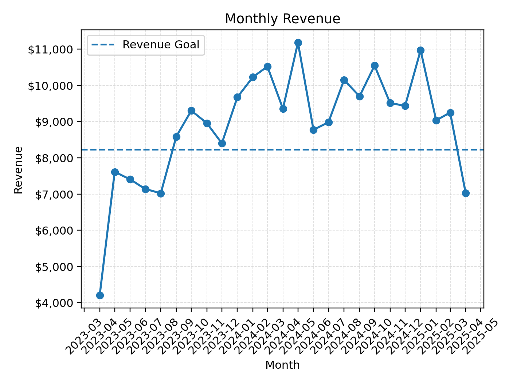
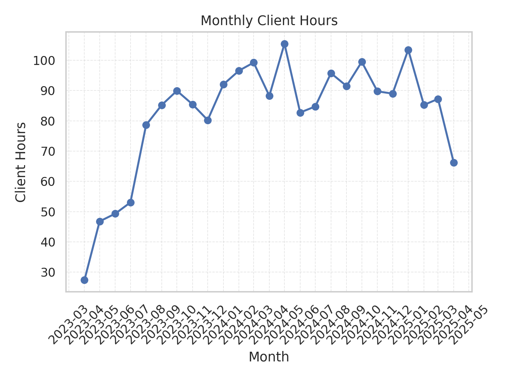
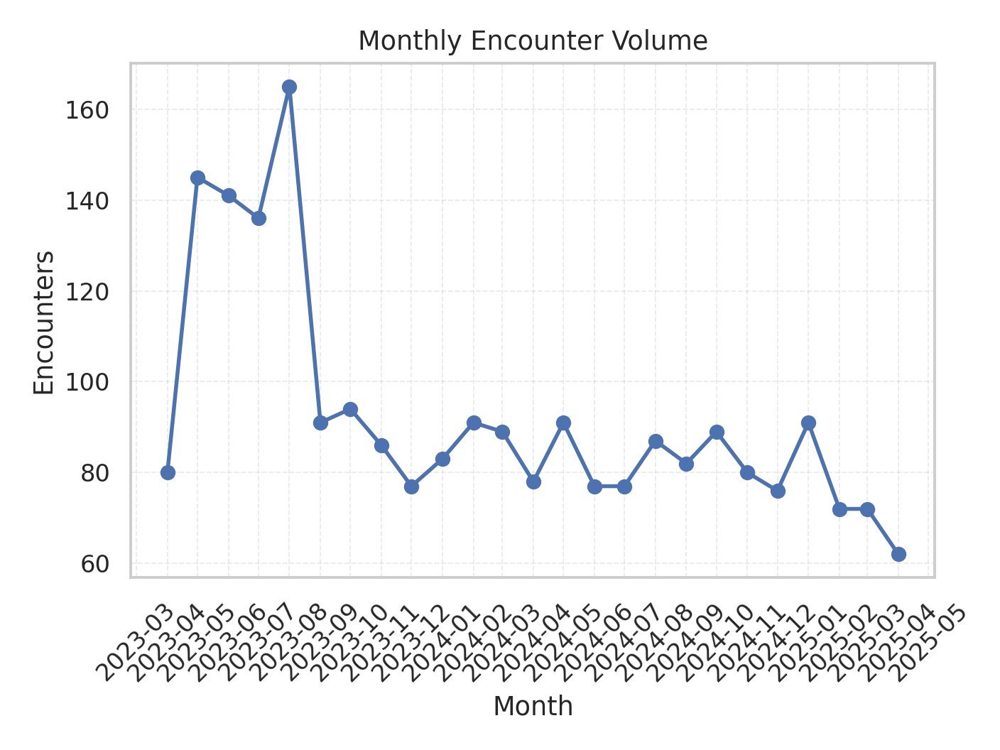
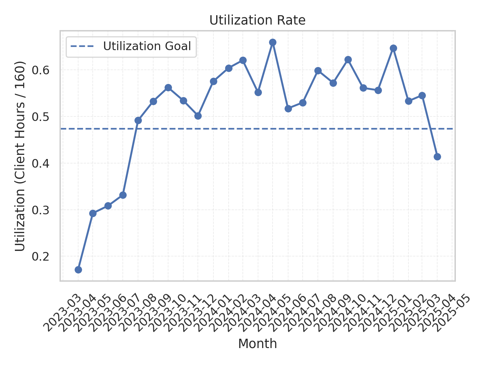

# Staff Productivity Analysis (KPI + Revenue Modeling)

## Executive Summary

This project shows how encounter-level service logs can be turned into monthly productivity and financial KPIs. The pipeline cleans raw data, converts time-based services into billable units, applies fiscal-year rate tables, and aggregates results into monthly trends. The end result is a reusable framework for evaluating provider productivity, revenue contribution, and utilization.

This project analyzes encounter-level service data __from a single provider__ to measure provider productivity, client engagement, and revenue contribution over time.

It demonstrates how operational service logs can be transformed into business-focused KPIs for performance evaluation and financial decision-making.

**Note:** This repository uses synthetic/de-identified data. No real client or private records are included.

---

## Business Objective

Given encounter-level service logs from a single provider, this project answers:

- How much revenue was generated each month?
- How many direct client hours were delivered each month?
- How do productivity and revenue trend over time?
- How did the provider perform compared to a set utilization standard?

---

## Data

The dataset is a synthetic version of a service-based encounter export.

Key fields:

- `encounter_date`
- `cpt_code`
- `duration_min`
- `is_billable`
- `encounter_status`

Example dataset:

```
data/sample_monthly_data.csv
```

---

## KPI Definitions

**Client Hours (Monthly)**  
`client_hours = sum(duration_min) / 60`

**Units (15-Minute Time-Based Billing)**  
`units = floor(duration_min / 15)`

**Revenue (Monthly)**  
Time-based services:  
`revenue = sum(units * billing_rate)`

Per-encounter services:  
`revenue = sum(encounters * billing_rate)`

**Revenue per Client Hour**  
`revenue_per_hour = monthly_revenue / monthly_client_hours`

**Cost–Benefit Ratio (Optional Analysis)**  
`roi = monthly_revenue / monthly_compensation`

---

## Results

The following visualizations are generated from the KPI notebook and saved in the `outputs/` directory.

### Monthly Revenue


### Monthly Client Hours


### Encounter Volume


### Utilization Rate


## Key Insights

### 1. Revenue Growth Follows Productivity Gains

Monthly revenue increases significantly beginning mid-2023 and stabilizes through 2024. This mirrors the increase in client hours delivered during the same period. The revenue goal line shows that performance consistently meets or exceeds target once steady productivity levels are reached.

Revenue dips in early and late periods correspond directly with reduced client hours, indicating that financial performance is primarily volume-driven rather than rate-driven during most of the observed period.

---

### 2. Sustained Increase in Client Hours

Client hours show a clear ramp-up from approximately 30-50 hours per month early in the timeline to a sustained 85-105 hour range. This indicates a significant improvement in utilization and schedule density.

The temporary decline in the most recent month corresponds with a drop in revenue and utilization, reinforcing that hours delivered are the main performance driver.

---

### 3. Encounter Volume Reflects Workflow and Billing Structure Changes

Monthly encounter volume shows a distinct shift in mid-2023. Early months display a much higher number of encounters per month, followed by a noticeable drop and stabilization.

This pattern aligns with a billing structure transition. Under the older T1012 model (approximately $50 per encounter), multiple encounters could be delivered within a single hour. Because billing did not accumulate across 15-minute intervals, providers often recorded more discrete encounters within the same block of time.

After August 2023, billing shifted to a cumulative 15-minute unit structure. Under this model, services are billed based on time increments rather than discrete per-encounter counts. As a result, encounter counts decreased while client hours and total revenue remained strong.

In other words, the decline in encounter volume reflects a change in documentation and billing mechanics - not a reduction in productivity.

---

### 4. Utilization Performance Relative to Target

The utilization goal of 17.5 client hours per week (≈75.8 hours per month) translates to a utilization benchmark of roughly 47% under a 160-hour monthly baseline.

From late 2023 through 2024, utilization consistently exceeds this benchmark, often reaching 55–65%. This indicates strong schedule density and sustained client engagement.

Periods below the goal align with lower total revenue months, confirming the relationship between client hours and financial output.

---

### Overall Interpretation

Across all four metrics, performance stabilizes after mid-2023 with:

- Consistent client hours above target
- Revenue regularly exceeding monthly goal
- A normalized revenue per hour after billing standardization
- Utilization sustained above benchmark levels

The combined analysis demonstrates that long-term revenue performance is driven primarily by client-hour volume and sustained utilization, rather than rate fluctuations alone.

---

## Repository Structure

```
staff-productivity-analysis/
├── README.md
├── requirements.txt
├── .gitignore
├── data/
│   └── sample_monthly_data.csv
├── notebooks/
│   ├── 01_data_cleaning.ipynb
│   ├── 02_revenue_calculation.ipynb
│   └── 03_kpi_analysis.ipynb
├── src/
│   ├── revenue_calculator.py
│   └── kpi_metrics.py
├── outputs/
│   ├── revenue_trends.png
│   ├── client_hours_trends.png
│   └── revenue_per_hour.png
└── report/
    └── performance_summary.pdf
```

---

## How to Run

1. Install dependencies:

```
pip install -r requirements.txt
```

2. Run notebooks in order:

```
01_data_cleaning.ipynb
02_revenue_calculation.ipynb
03_kpi_analysis.ipynb
```

---

## Tools Used

- Python
- pandas
- numpy
- matplotlib
- seaborn
- Jupyter Notebook

---

## Skills Demonstrated

- Data cleaning and normalization
- Revenue modeling from operational logs
- Time-based billing calculations
- KPI design and performance tracking
- Financial impact analysis
- Data visualization for decision support

---

## Disclaimer

This project is for portfolio demonstration purposes only.  
All data is synthetic or de-identified. Billing rates and examples are illustrative.
